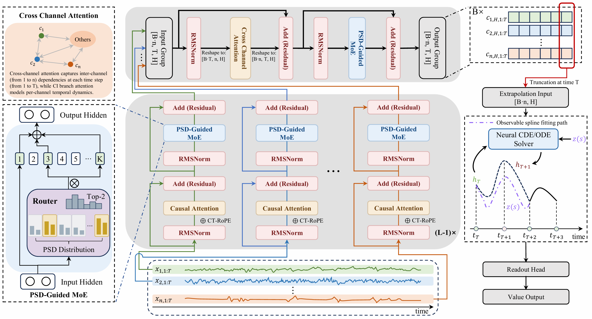

<div align="center">
  <h2><b>SOTER: A Generative Time-Series Foundation Model for Wearable Human Physiological Signals</b></h2>
</div>

<div align="center">

**[<a href="http://arxiv.org/abs/2609.16804">Paper</a>]** <!-- TODO: replace with the SOTER arXiv link -->
**[<a href="https://huggingface.co/SII-fkchen/SOTER">Model Weights</a>]**
**[<a href="https://github.com/SII-fkchen/SOTER">GitHub</a>]**

</div>

## Overview
SOTER is a domain-specialized generative time-series foundation model engineered specifically for wearable human physiological signals. To address the intrinsic physical complexities of wearable biosignals—such as coupled multichannel dynamics, heterogeneous spectral scales, and irregular continuous-time sampling—SOTER unifies three domain-grounded architectural components into a single pre-training framework:
- **Spatial Feature-Aware Backbone:** Employs channel-independent temporal modeling in shallow layers while restoring cross-channel interactions at the topmost attention layer to capture inter-signal physiological dependencies without premature leakage.
- **PSD-Guided Mixture-of-Experts:** Incorporates an inspectable, deterministic routing mechanism that computes a strictly causal prefix discrete Fourier transform (DFT) to map latent states directly to fixed frequency bands, eliminating learned gating collapse and auxiliary balancing losses.
- **Neural CDE/ODE Continuous-Time Decoder:** Advances latent representations to arbitrary query timestamps through numerical integration, seamlessly unifying observation-guided causal imputation and autonomous future forecasting.

Pre-trained on 226 billion time points across diverse clinical and ambulatory waveforms, SOTER achieves good performance across out-of-distribution zero-shot forecasting, frozen linear-probe classification, and continuous-time imputation—all while activating only 20.29M parameters per inference step.

<p align="center">
   
</p>

## Installation

Requires Python 3.10+:

```bash
git clone https://github.com/SII-fkchen/SOTER.git
cd SOTER
conda create -n soter python=3.10 -y
conda activate soter
pip install -r requirements.txt
```
**Note:** the terminal ODE block requires [`torchdiffeq`](https://github.com/rtqichen/torchdiffeq), already listed in `requirements.txt`.


## Inference

Download the weights from [Hugging Face](https://huggingface.co/SII-fkchen/SOTER).

```python
import torch
from safetensors.torch import load_file
from soter.models.modeling_soter import SoterConfig, SoterForPrediction

ckpt = "/path/to/weight"
config = SoterConfig.from_pretrained(ckpt)
model = SoterForPrediction(config)
model.load_state_dict(load_file(f"{ckpt}/model.safetensors"), strict=True)
model.eval().cuda()
```

`values` should be per-channel MinMax-normalized (scaler fitted on the training split), while `times` are the RAW physical timestamps (e.g. seconds), strictly increasing.

```python
C, P = 128, 64
# C = history length
# P = forecast horizon
values = ...  # np.ndarray [C + P], float32
times  = ...  # np.ndarray [C + P], float32

cur_vals  = torch.tensor(values[:C], dtype=torch.float32).view(1, -1, 1).cuda()
cur_times = torch.tensor(times[:C],  dtype=torch.float32).view(1, -1).cuda()

preds = []
with torch.inference_mode():
    for i in range(P):
        next_t = torch.tensor([times[C + i]], device="cuda")
        out = model(
            input_ids=cur_vals,
            time_values=cur_times,
            next_target_time_values=next_t,
            attention_mask=torch.ones_like(cur_times, dtype=torch.long),
            return_dict=True,
        )
        nxt = out.logits[:, -1, :]            # [1, 1]
        preds.append(nxt)
        cur_vals  = torch.cat([cur_vals, nxt.unsqueeze(-1)], dim=1)
        cur_times = torch.cat([cur_times, next_t.view(1, 1)], dim=1)

preds = torch.stack(preds, dim=1).squeeze(0).cpu().numpy()  # [P]
```

Or run the full evaluation script on your own JSONL data (run from the repo root):

```bash
python forecasting_example.py \
  --model ./path/to/weight \
  --data ./test_set.jsonl \
  --train_jsonl ./train_set.jsonl \
  --context <history length> \
  --horizon <forecast horizon> \
  --num_eval <number of samples to be evaluated>
```
Setting --num_eval to "all" activates full-scale inference.

## Input data format

Example (2-channels):
```json
{"sequence": [[1.0, 0.3], [1.2, 0.4], [0.8, 0.2]], "time": [0.12, 0.22, 0.41], "mask": [[1, 1], [1, 0], [1, 1]]}
```

## Training Datasets
> **Data Access Notice:** All datasets utilized in this project consist of clinical and physiological time-series data involving sensitive human subject information. In compliance with strict Data Use Agreements (DUAs) and credentialed access policies, raw data cannot be hosted or redistributed in this repository. Researchers must request access directly from the official data providers listed below.

- **MIMIC-III-Waveform** — 
Access link: https://physionet.org/content/mimic3wdb/1.0/
- **Sleep-EDF** — 
Access link: https://physionet.org/content/sleep-edfx/1.0.0/
- **PTB-XL** — 
Access link: https://physionet.org/content/ptb-xl/1.0.3/
- **WESAD** — 
Access link: https://archive.ics.uci.edu/dataset/465/wesad+wearable+stress+and+affect+detection
- **Chapman-ECG** — 
Access link: https://physionet.org/content/ecg-arrhythmia/1.0.0/

## Contact

If you have any questions regarding SOTER, please feel free to contact:

- Fangke Chen: [fkchen@zju.edu.cn](mailto:fkchen@zju.edu.cn)


## License

This project is released under the [MIT License](LICENSE).


## Citation

If you find SOTER useful, please cite our paper:

```bibtex
@article{soter2026,
  title   = {SOTER: TODO},
  author  = {TODO},
  journal = {arXiv preprint arXiv:XXXX.XXXXX},
  year    = {2026}
}
```


